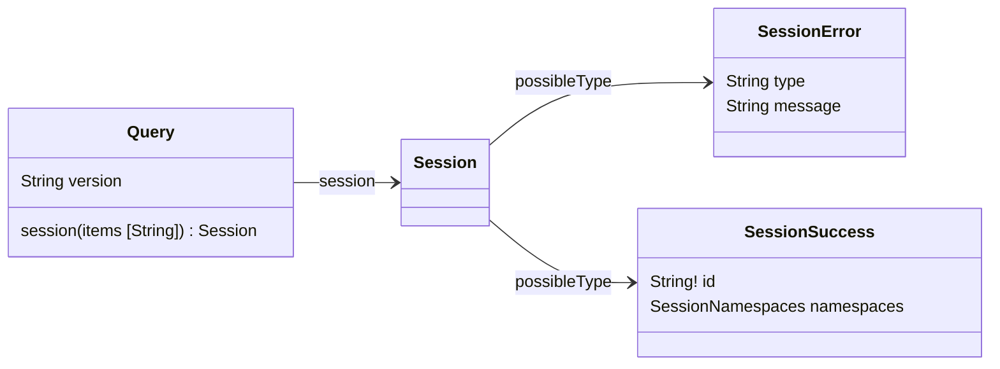
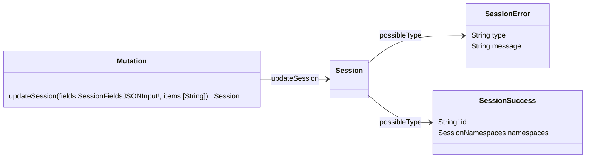

# Session Client GraphQL API

This API manages the [`vtex_session` cookie](https://developers.vtex.com/docs/guides/sessions-system-overview#vtexsession-cookie), which holds session-related data for users. Developers can either interact with the API endpoints directly or declare this app as a dependency to leverage its [React functions](https://developers.vtex.com/docs/apps/vtex.session-client#react-hooks).

## Schema overview

### Query

<table>
  <thead>
    <tr>
      <th align="left">Field</th>
      <th align="right">(argument)</th>
      <th align="left">Type</th>
      <th align="left">Description</th>
    </tr>
  </thead>
  <tbody>
    <tr>
      <td colspan="2" valign="top"><strong id="query.session">session</strong></td>
      <td valign="top"><a href="#session">Session</a></td>
      <td>Retrieves the <code>vtex_session</code> cookie content if successful. The <a href="https://developers.vtex.com/docs/api-reference/session-manager-api#get-/api/sessions" target="_blank">Get session</a> endpoint from the Session Manager API is an equivalent implementation in REST. The <code>Session</code> union has two possible types: <code>SessionError</code> and <code>SessionSuccess</code>.</td>
    </tr>
    <tr>
      <td colspan="2" align="right" valign="top">items</td>
      <td valign="top">[String]</td>
      <td>Specifies the items from the <code>vtex_session</code> cookie that will be returned in the response. Each string defines the namespace and value of the items, with the <code>"{namespace}.{value}"</code> format. If this argument isn't declared, the response will have all the items in the <code>namespace</code> field. Example: <code>["store.channel", "store.countryCode", "impersonate.canImpersonate"]</code>.</td>
    </tr>
  </tbody>
</table>

### Mutation

<table>
  <thead>
    <tr>
      <th align="left">Field</th>
      <th align="right">(argument)</th>
      <th align="left">Type</th>
      <th align="left">Description</th>
    </tr>
  </thead>
  <tbody>
    <tr>
      <td colspan="2" valign="top"><strong id="mutation.updatesession">updateSession</strong></td>
      <td valign="top"><a href="#session">Session</a></td>
      <td>Updates fields in the <code>public</code> namespace of the <code>vtex_session</code> cookie and returns the updated content. The <a href="https://developers.vtex.com/docs/api-reference/session-manager-api#patch-/api/sessions" target="_blank">Edit session</a> endpoint from the Session Manager API is an equivalent implementation in REST. The <code>Session</code> union has two possible types: <code>SessionError</code> and <code>SessionSuccess</code>.</td>
    </tr>
    <tr>
      <td colspan="2" align="right" valign="top">fields</td>
      <td valign="top">SessionFieldsJSONInput!</td>
      <td>A JSON object with the public fields to be updated. Since this is equivalent to a PATCH request, the request will have the following behavior with this field: <ul><li>Fields that exist in the cookie and aren't declared in this field will not be changed.</li><li>Fields that exist in the cookie and are declared in this field will have their values updated.</li><li>Fields that don't exist in the cookie and are declared in this field will be created.</li></ul>Example: <code>{ "foo": 123, "baz": "abc" }</code>.</td>
    </tr>
    <tr>
      <td colspan="2" align="right" valign="top">items</td>
      <td valign="top">[String]</td>
      <td>Specifies the items from the <code>vtex_session</code> cookie that will be returned in the response. Each string defines the namespace and value of the items. If this argument isn't declared, the response will have all the items in the <code>namespace</code> field. Example: <code>["store.channel", "store.countryCode", "impersonate.canImpersonate"]</code>.  Tip: To only show the updated fields in the response, use the <code>public</code> namespace along with the field name. Example: <code>["public.supportedLocales"]</code>.</td>
  </tr>
  </tbody>
</table>

## Schema description

>⚠️ Arguments must be provided by the user. Required fields are marked with an exclamation mark (`!`).

### SessionError

<table>
  <thead>
    <tr>
      <th align="left">Field</th>
      <th align="right">(argument)</th>
      <th align="left">Type</th>
      <th align="left">Description</th>
    </tr>
  </thead>
  <tbody>
    <tr>
      <td colspan="2" valign="top">
        <strong id="sessionerror.type">type</strong>
      </td>
      <td valign="top">String</td>
      <td>Session error type.</td>
    </tr>
    <tr>
      <td colspan="2" valign="top">
        <strong id="sessionerror.message">message</strong>
      </td>
      <td valign="top">String</td>
      <td>Session error message.</td>
    </tr>
  </tbody>
</table>

<a href="#session">Session</a> 🔽

### SessionSuccess

<table>
  <thead>
    <tr>
      <th align="left">Field</th>
      <th align="right">(argument)</th>
      <th align="left">Type</th>
      <th align="left">Description</th>
    </tr>
  </thead>
  <tbody>
    <tr>
      <td colspan="2" valign="top">
        <strong id="sessionsuccess.id">id</strong>
      </td>
      <td valign="top">String!</td>
      <td>Session ID.</td>
    </tr>
    <tr>
      <td colspan="2" valign="top">
        <strong id="sessionsuccess.namespaces">namespaces</strong>
      </td>
      <td valign="top">SessionNamespaces</td>
      <td>Namespaces object with the content of the <code>vtex_session</code> cookie. Each namespace has fields with specific information about the session. Check all the possible namespaces in the <a href="https://developers.vtex.com/docs/guides/sessions-system-overview#vtexsession-cookie" target="_blank">Sessions System documentation</a>.</td>
    </tr>
  </tbody>
</table>

<a href="#session">Session</a> 🔽

### Session

<table>
  <thead>
    <tr>
      <th align="left">Type</th>
      <th align="left">Description</th>
    </tr>
  </thead>
  <tbody>
    <tr>
      <td valign="top">
        <strong><a href="#sessionerror">SessionError</a></strong>
      </td>
      <td>Returned when a session error occurs. It provides the error type and message.</td>
    </tr>
    <tr>
      <td valign="top">
        <strong><a href="#sessionsuccess">SessionSuccess</a></strong>
      </td>
      <td>Returned when the operation succeeds. It includes the content of the session cookie.</td>
    </tr>
  </tbody>
</table>

<a href="#query">Query</a> 🔼

<a href="#mutation">Mutation</a> 🔼

